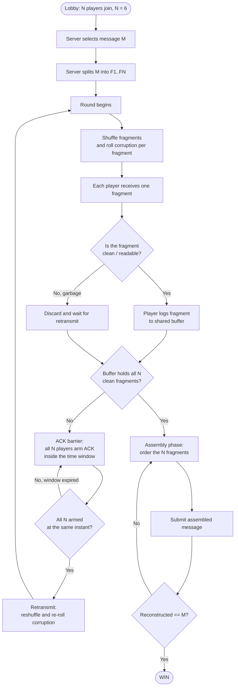
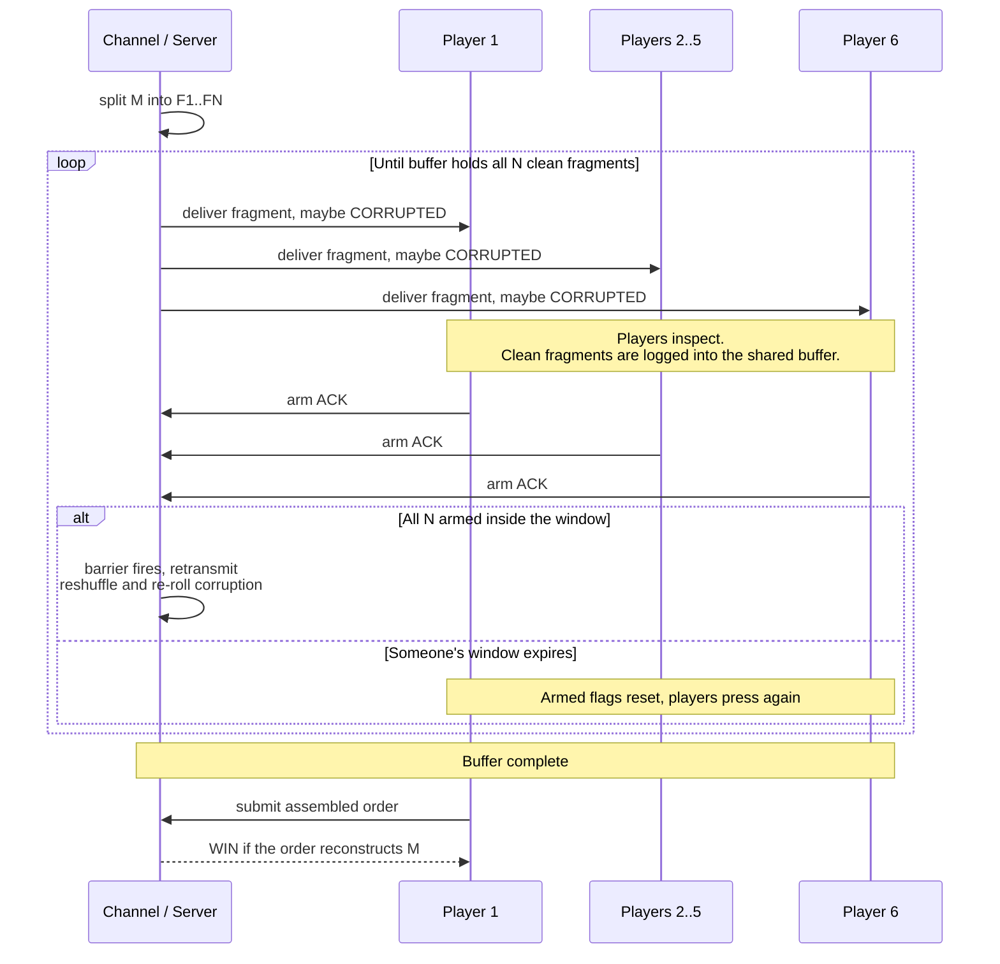
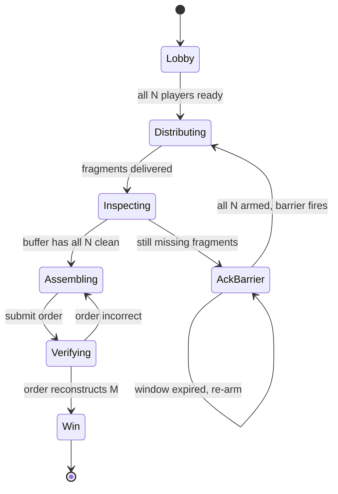

# SITCON Camp 2026 封包遊戲

# ACK! — A Co-op Packet Reassembly Game

> A real-time cooperative game for **N players** (default **N = 6**). The system splits one message into N fragments, ships them over a _lossy channel_, and the players must collectively retransmit and reassemble the original message.
>
> Under the hood this is a hands-on simulation of **segmentation, bit-errors, ARQ retransmission, out-of-order delivery, and reassembly buffers**.

---

## 1. TL;DR

1. A hidden message `M` (a sentence) is split into `N` fragments.
2. Each round, the fragments are **shuffled** and delivered one-per-player. Some arrive as **garbage** (`"12ejlk2;jas"`) because the channel is noisy.
3. Each player reads their fragment. If it is clean, they **log it** into the shared buffer.
4. As long as the buffer is **missing any fragment**, all `N` players must press **ACK at the same time** to trigger a **retransmit** (reshuffle + re-roll corruption).
5. Once the buffer holds all `N` clean fragments, the team **orders them** and **submits**. Correct order ⇒ **WIN**.

The fun lives in two places: the **synchronized ACK** (everyone must press together) and the **final ordering puzzle**.

---

## 2. The metaphor

This is the part worth keeping in mind while balancing the game — every mechanic maps to a real networking concept.

| Game element                                | Real networking concept                          |
| ------------------------------------------- | ------------------------------------------------ |
| The message `M` (a sentence)                | Application-layer payload                        |
| Splitting `M` into `N` fragments            | Segmentation / IP fragmentation                  |
| Each player = one receiver slot             | A per-flow receive buffer slot                   |
| Garbage fragment `"12ejlk2;jas"`            | Bit errors / failed checksum (CRC mismatch)      |
| Pressing **ACK** to force a resend          | Retransmission request (ARQ)                     |
| All `N` must ACK **together**               | Synchronized / barrier-style retransmit          |
| Reshuffled delivery each round              | Out-of-order delivery                            |
| Shared buffer that collects clean fragments | Reassembly buffer                                |
| Ordering fragments correctly                | Reordering by sequence number                    |
| Submitting the assembled message            | Delivering the reassembled payload up to the app |

> **Protocol-accuracy note (optional rename):** In real ARQ, an `ACK` _confirms correct receipt_ ("stop sending"), and it's a missing-ACK or a `NAK` that triggers a resend. In this game the button players press to _request a resend_ is functionally a **collective NAK / RESEND**. Keep the label `ACK` if you like the word; if you want it protocol-accurate, label it `NAK` or `RESEND`.

---

## 3. Players, channel, and shared space

- **Players** — `N` symmetric receivers. No special roles in the core mode.
- **Channel / Server** — authoritative. Owns `M`, fragmentation, the corruption RNG, the ACK barrier, and verification. Players only send _inputs_; the server owns _truth_.
- **Shared space** — synced live to everyone, with three zones:
  1. **Inbox** — the single fragment _you_ received this round (clean text or garbage).
  2. **Buffer** — the shared collection of clean fragments gathered so far (`x / N` slots filled). Persists across rounds.
  3. **Assembly** — once the buffer is full, an ordered arrangement of the `N` fragments that the team edits together.

---

## 4. Core game loop

```
LOBBY ─► pick M ─► split into F1..FN
   │
   ▼
ROUND ─► shuffle fragments ─► roll corruption per fragment ─► deliver 1 per player
   │
   ▼
INSPECT ─► each player reads their fragment ─► if clean, log it to the buffer
   │
   ├─ buffer incomplete ─► ACK BARRIER (all N arm together) ─► RETRANSMIT ─┐
   │                                                                       │
   └─ buffer complete ─► ASSEMBLE (order the N fragments) ─► SUBMIT        │
                                                                           │
   ◄───────────────────────────────────────────────────────────────────  ┘
SUBMIT ─► reconstructed == M ? ─► WIN : back to ASSEMBLE
```

---

## 5. Mechanics in detail

### 5.1 Message & fragmentation

- `M` is drawn from a message pool (a sentence; can be a quote, a song line, a fact, etc.).
- `M` is split **evenly by character count** into `N` contiguous fragments `F1..FN`. Whitespace is part of the chunks, so **concatenating the fragments in the right order reproduces `M` exactly** (join = `""`).
- Aim `len(M)` at roughly `N * 4` to `N * 8` characters so each chunk is a meaningful-but-not-trivial slice.
- Fragments carry a hidden `seq` index `1..N`. **Players never see `seq`** — recovering the order _is_ the puzzle.

### 5.2 Corruption model

- Each round, **every** fragment is delivered (one per player), but each independently has probability `p` of arriving **corrupted** — replaced by random garbage of similar length.
- A corrupted fragment is obviously non-linguistic (`"12ejlk2;jas"`), so players can recognize it on sight.
- Suggested `p = 0.30 – 0.40`. With `p = 0.35`, `N = 6`: ~92% chance at least one fragment is corrupted in round 1, and a typical game converges in ~4–5 rounds.
- Optional flag `guarantee_first_corrupt = true` forces ≥1 corruption in round 1 so the ACK mechanic always gets used.

### 5.3 The shared buffer (reassembly buffer)

- Has `N` slots, one per `seq`. Persists across rounds.
- A player logs their _current_ fragment via a **"Log my fragment"** action.
  - **Clean** ⇒ server accepts it and fills the matching `seq` slot (dedup: re-logging an already-held fragment is a no-op).
  - **Garbage** ⇒ server **rejects** the log (toast: _"looks corrupted"_). The buffer can never be polluted, because the server is authoritative and knows the real fragments.
- Net effect: across enough retransmits, every fragment eventually arrives clean to _someone_ and gets banked. The buffer fills monotonically — just like real reassembly under a lossy link.

### 5.4 The ACK barrier (simultaneous press)

This is the cooperative heartbeat. To trigger a retransmit, **all `N` players must be "armed" at the same instant.**

- Pressing **ACK** _arms_ you for a short window `T_ack` (suggested **3s**), then auto-disarms.
- If, at any instant, **all `N` players are armed simultaneously**, the barrier **fires** ⇒ retransmit.
- If anyone's window expires before the group lines up, they disarm and must press again.
- Consequence: one AFK / uncooperative player stalls the whole team. (See edge cases for AFK handling.)

### 5.5 Retransmission & reshuffle

When the barrier fires:

1. The full message is re-fragmented (same `F1..FN`).
2. Fragments are **randomly permuted** across the `N` player slots (out-of-order delivery).
3. Each delivered fragment **independently re-rolls** corruption with probability `p`.
4. A new INSPECT round begins.

Already-banked fragments **stay** in the buffer — you only keep retransmitting to fill the _remaining_ empty slots.

### 5.6 Assembly & submission

- Unlocks when the buffer is full (`N / N`).
- The team drags the `N` fragment chips into an order in the shared **Assembly** zone (anyone can rearrange; changes sync live).
- **Submit** ⇒ server checks `join(orderedFragments, "") === M`.
  - Match ⇒ **WIN**.
  - No match ⇒ back to Assembly. (Optionally a small time penalty per wrong submit.)
- Because success is judged on the **reconstructed string**, interchangeable/duplicate fragments that still rebuild `M` are accepted.

---

## 6. Win / lose & scoring

- **Win condition:** reconstructed string equals `M`.
- **No hard lose** in the core mode — it's co-op and the buffer only fills, so the team always converges. Difficulty comes from coordination + the ordering puzzle.
- **Optional scoring** (lower = better, rewards an efficient channel):

| Metric             | Definition                                           |
| ------------------ | ---------------------------------------------------- |
| Retransmits        | Number of times the ACK barrier fired                |
| Channel efficiency | `N / (N + corrupted_deliveries)` over the whole game |
| Time-to-solve      | Lobby-start → correct submit                         |
| Wrong submits      | Incorrect assembly attempts                          |

---

## 7. Tunable parameters

| Param                     | Meaning                             | Suggested     |
| ------------------------- | ----------------------------------- | ------------- |
| `N`                       | Players & fragments                 | `6`           |
| `p`                       | Per-fragment corruption probability | `0.30 – 0.40` |
| `T_ack`                   | ACK arm window (seconds)            | `3`           |
| `guarantee_first_corrupt` | Force ≥1 corruption in round 1      | `true`        |
| `reshuffle`               | Permute fragment→player each round  | `true`        |
| `min_len / max_len`       | Message length bounds (chars)       | `N*4 … N*8`   |
| `wrong_submit_penalty`    | Optional cooldown on bad submit     | `0–5s`        |

---

## 8. Edge cases & rulings

| Situation                                        | Ruling                                                                                                                |
| ------------------------------------------------ | --------------------------------------------------------------------------------------------------------------------- |
| A player is AFK ⇒ barrier can never fire         | Auto-arm idle players after `2 * T_ack`, **or** allow a host to replace/kick. Pick one; auto-arm is the simplest MVP. |
| Player logs garbage                              | Server rejects; no buffer pollution, no penalty. Recognizing garbage just saves clicks.                               |
| Duplicate fragments in `M` (e.g. repeated chunk) | Allowed — success is judged on the full reconstructed string, so interchangeable chunks pass.                         |
| Mid-round disconnect                             | On reconnect, resync from server state (buffer + current inbox). Server is authoritative, so no state is lost.        |
| Buffer fills mid-round before everyone logs      | Immediately unlock Assembly; remaining unlogged inboxes are irrelevant.                                               |
| Two players drag the same chip simultaneously    | Last-write-wins on the shared assembly order (server-sequenced).                                                      |

---

## 9. Variants / modes

- **Hidden Sender (asymmetric):** one player sees full `M` but can only communicate through a heavily rate-limited channel — a hidden-information co-op twist.
- **Checksum mode (easier):** corrupted slots are flagged red instead of shown as raw garbage; removes the "is this garbage?" judgment.
- **Strict ARQ (harder):** delivery can also _drop_ a fragment entirely (empty inbox), not just corrupt it.
- **Campaign:** chain messages into levels; carry the channel-efficiency score across the run.
- **Timed channel:** a per-round timer; if the team doesn't ACK in time, a forced retransmit fires anyway (jitter pressure).

---

## 10. Diagrams

### 10.1 Main game flow



### 10.2 ACK / retransmit protocol (sequence)



### 10.3 Session state machine



---

## 11. MVP architecture sketch (optional)

Keep it small — server-authoritative state + a thin reactive client.

**Realtime / server**

- `Bun.serve` with native WebSocket; one room per game (`roomId`).
- Server holds the only source of truth: `M`, fragments, corruption RNG, ACK arm-flags, buffer, assembly order, phase.
- Clients send _intents_ (`arm_ack`, `log_fragment`, `set_order`, `submit`); server validates and broadcasts the new room snapshot.

**Shared state shape (TS):**

```ts
type Phase =
	| 'lobby'
	| 'distributing'
	| 'inspecting'
	| 'ackBarrier'
	| 'assembling'
	| 'verifying'
	| 'win';

interface Fragment {
	seq: number; // hidden from clients
	text: string; // hidden from clients
}

interface PlayerView {
	id: string;
	inbox: string; // clean text OR garbage, for THIS player this round
	acked: boolean; // armed flag
}

interface RoomState {
	phase: Phase;
	n: number; // 6
	round: number;
	buffer: (string | null)[]; // length n, by seq; null = slot not yet banked
	assembly: string[]; // current ordered guess (assembling phase)
	players: PlayerView[];
	// server-only fields (never serialized to clients): message, fragments, rng seed
}
```

**Client (Svelte 5)**

- Hold `RoomState` in a `$state` rune; patch it from each WS broadcast.
- `$derived` for computed UI (`collected = buffer.filter(Boolean).length`, `allArmed = players.every(p => p.acked)`).
- `$effect` only for the WS subscription lifecycle (open/close/reconnect).
- No client-side trust: the buffer, corruption, and verification all come from the server.

**Config**

- Message pool + tunables live in a single config file (JSON/TOML); no DB needed for the MVP. Add SQLite later only if you want leaderboards or a persistent campaign.
