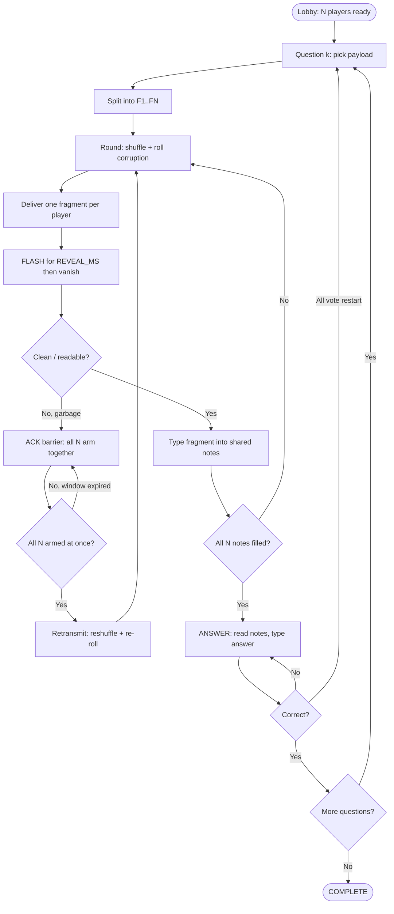
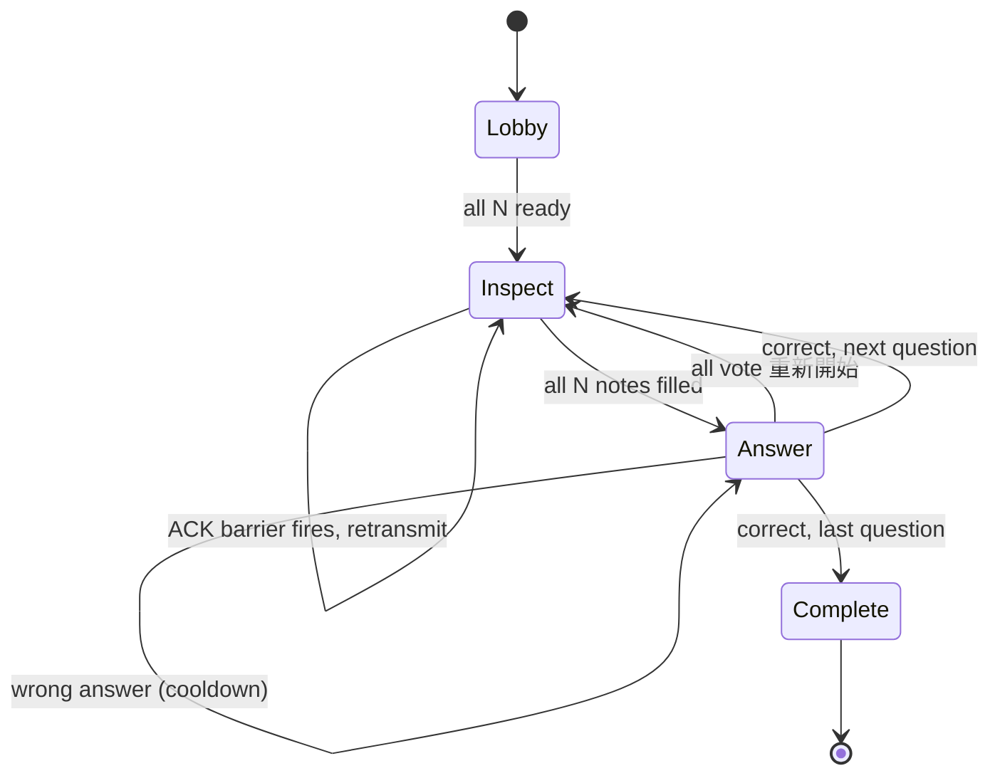

# SITCON Camp 2026 封包遊戲

# ACK! — A Co-op Packet Reassembly Game

> A real-time cooperative game for **N players**. The system ships fragments of a question over a _lossy channel_; each fragment **flashes briefly then vanishes**, so the team must transcribe what they saw from memory, retransmit anything that arrived as garbage, and collectively answer.
>
> Under the hood this is a hands-on simulation of **segmentation, bit-errors, ARQ retransmission, out-of-order delivery, and reassembly buffers** — with a human memory buffer standing in for the receive buffer.

---

## 1. TL;DR

The game has **exactly two questions**:

1. **Q1 — Sentence (memory):** `請問你參加的夏令營的主辦單位英文縮寫是什麼？` is split into `N` fragments, one per player. Each fragment is shown for **15 s** (`.env` configurable) and then disappears. Players type what they saw into a shared **notes** buffer. Answer: `SITCON`.
2. **Q2 — Logic clues:** the round-table logic puzzle clues are flashed the same way. Players transcribe the clues into shared notes, then answer `CC 的右手邊是誰？`. Answer: `Tang`.

For both questions the loop is identical:

1. A fragment **flashes** for `REVEAL_MS` then vanishes.
2. If it arrived as **garbage** (`"▓░█▒"`) you can't read it → all `N` players press **ACK together** to trigger a **retransmit** (reshuffle + re-roll corruption).
3. Clean fragment → you **type it into the shared notes** (`input`). Notes are a free-text scratchpad — the server **never validates their content**.
4. Once every slot has a note, the team moves to **answer**: read the collected notes, type the final answer, submit.
5. If the notes are too gappy, **everyone votes "重新開始"** to re-flash the current question.

The fun lives in three places: the **15 s memory pressure**, the **synchronized ACK** (everyone presses together to resend a corrupt fragment), and the **collective transcription** under a lossy channel.

---

## 2. The metaphor

Every mechanic maps to a real networking concept.

| Game element                                 | Real networking concept                              |
| -------------------------------------------- | ---------------------------------------------------- |
| The question (sentence / clue set)           | Application-layer payload                            |
| Splitting it into `N` fragments              | Segmentation / IP fragmentation                      |
| Each player = one receiver slot              | A per-flow receive buffer slot                       |
| Fragment **flashes then vanishes** (15 s)    | A packet you must process before the buffer ages out |
| Garbage fragment `"▓░█▒"`                    | Bit errors / failed checksum (CRC mismatch)          |
| Pressing **ACK** to force a resend           | Retransmission request (ARQ)                         |
| All `N` must ACK **together**                | Synchronized / barrier-style retransmit              |
| Reshuffled delivery each round               | Out-of-order delivery                                |
| Shared **notes** that collect transcriptions | Reassembly buffer (human-side)                       |
| Typing the final answer                      | Delivering the reassembled payload up to the app     |

> **Protocol-accuracy note:** the button players press to _request a resend_ is functionally a **collective NAK / RESEND**. The label `ACK` is kept for flavour; rename to `NAK`/`RESEND` if you want it protocol-accurate.

---

## 3. Players, channel, and shared space

- **Players** — `N` symmetric receivers. No special roles. `N ≥ MIN_PLAYERS` (default 5).
- **Channel / Server** — authoritative. Owns the question, fragmentation, the corruption RNG, the ACK barrier, and answer verification. Players only send _intents_; the server owns _truth_.
- **Shared space** — synced live to everyone:
  1. **Inbox** — the single fragment _you_ received this round. **Visible for `REVEAL_MS` only**, then it vanishes.
  2. **Notes (buffer)** — the shared collection of transcribed fragments (`x / N` slots filled). Free text, never validated, persists across retransmits.

---

## 4. Core game loop

```
LOBBY ─► all ready ─► QUESTION 1 (sentence) ─► … ─► QUESTION 2 (clues) ─► COMPLETE

per QUESTION:
   pick payload ─► split into F1..FN
   │
   ▼
ROUND ─► shuffle fragments ─► roll corruption per fragment ─► deliver 1 per player
   │
   ▼
FLASH ─► each fragment visible REVEAL_MS, then vanishes
   │
   ├─ clean ─► player TYPES it into shared notes (input) ─┐
   │                                                       │
   └─ garbage ─► can't read ─► ACK BARRIER (all N arm) ─► RETRANSMIT ─► ROUND
                                                           │
   ◄───────────────────────────────────────────────────  ┘
   all N notes filled ─► ANSWER ─► type answer ─► submit
                              │
                              ├─ correct ─► next question / COMPLETE
                              ├─ wrong ─► cooldown, stay in ANSWER
                              └─ all vote 重新開始 ─► reset this question ─► ROUND
```

---

## 5. Mechanics in detail

### 5.1 The two question pools

- **Q1 (`Q1_POOL`, `type: "sentence"`):** a sentence is split **evenly by character count** into `N` contiguous fragments. The reassembled sentence _is_ the question; the team answers `SITCON`.
- **Q2 (`Q2_POOL`, `type: "clues"`):** a round-table logic puzzle. Each **clue string is one fragment**. The answer is the person immediately to CC's right, `Tang`. The number of clues need not equal `N` — extra clues are delivered across retransmit rounds; fewer clues just means some players share one.

### 5.2 The flash (ephemeral delivery)

- When a fragment is delivered it is shown with a **countdown for `REVEAL_MS`** (default **15 000 ms**, env-controlled).
- After the window the fragment text is **masked** (`封包已消失，請憑記憶輸入`). The transcription `input` stays open.
- The flash is purely client-side timing; the server delivers the fragment once and the client runs the countdown.

### 5.3 Corruption model

- Each round every fragment is delivered (one per player), each independently corrupted with probability `CORRUPTION_CHANCE` (default `0.4`) — replaced by obvious garbage (`"▓░█▒■□"`).
- A corrupt fragment **cannot be transcribed** (the input is disabled); the only path forward is to **ACK for a retransmit**.
- `GUARANTEE_CORRUPT=true` forces ≥1 corruption in round 1 so the ACK mechanic always gets exercised.

### 5.4 The shared notes (reassembly buffer)

- `N` slots, one per fragment `slot`. Persists across retransmits and fills monotonically.
- A player transcribes their _current_ fragment via the **記錄** action (`input` → `log_fragment`).
  - **Clean** ⇒ server stores the **typed text** into the matching slot. **Content is never checked against the truth** — it's a collaborative note (`充當 note`).
  - **Garbage** ⇒ server rejects (`封包損毀，無法記錄`). The buffer can never be filled from an unreadable fragment.
- Across enough retransmits every slot eventually arrives clean to _someone_ and gets transcribed. When all `N` slots hold a note ⇒ **answer phase**.

### 5.5 The ACK barrier (simultaneous press)

To trigger a retransmit, **all `N` players must be armed at the same instant**.

- Pressing **ACK** _arms_ you for `T_ack`, then auto-disarms.
- If at any instant **all `N` are armed simultaneously**, the barrier **fires** ⇒ retransmit (reshuffle unfilled slots + re-roll corruption).
- There is no auto-arm bypass; all connected players must coordinate the ACK barrier.

### 5.6 Answer & restart

- **Answer phase** shows the question `prompt` and the collected notes (joined for sentence, listed for clues). The true payload is **not** re-shown — you answer from your notes.
- **Submit** ⇒ server compares `normalize(answer)` (trim, collapse whitespace, uppercase).
  - Correct ⇒ advance to the next question, or **COMPLETE** after Q2.
  - Wrong ⇒ short cooldown (`WRONG_PENALTY`), stay in answer.
- **重新開始 (restart):** any player can vote; when **all `N` players have voted**, the **current question** resets — notes cleared, fresh fragments re-flashed. Use it when the notes are too incomplete to answer.

---

## 6. Win / lose

- **Win:** answer both questions correctly.
- **No hard lose** — co-op; the notes only fill and the team can always retransmit or restart. Difficulty comes from the 15 s memory pressure, coordination on the ACK barrier, and the Q2 deduction.

---

## 7. Tunable parameters (`.env`)

| Env var             | Meaning                                          | Default |
| ------------------- | ------------------------------------------------ | ------- |
| `WS_PORT`           | Bun WebSocket port                               | `8080`  |
| `MIN_PLAYERS`       | Minimum players to start                         | `5`     |
| `REVEAL_MS`         | How long a fragment stays visible (flash window) | `15000` |
| `T_ACK`             | ms a player stays armed (all must overlap)       | `3000`  |
| `CORRUPTION_CHANCE` | Per-fragment corruption probability `0.0–1.0`    | `0.4`   |
| `GUARANTEE_CORRUPT` | Force ≥1 corruption in round 1                   | `true`  |
| `WRONG_PENALTY`     | ms cooldown after a wrong answer                 | `3000`  |

> Questions per game is fixed at **2** (`MAX_ROUNDS` in `src/lib/config.ts`).

---

## 8. Edge cases & rulings

| Situation                                | Ruling                                                                         |
| ---------------------------------------- | ------------------------------------------------------------------------------ |
| A player is AFK ⇒ barrier can never fire | The room waits; coordinate before starting or reconnect/reset the room.        |
| Player's fragment is corrupt             | Transcription input disabled; they ACK for a retransmit. No buffer pollution.  |
| Player mistypes their note               | Allowed — notes are never validated. Verification is only the final answer.    |
| Notes too gappy to answer                | All players vote **重新開始** to re-flash the current question.                |
| Mid-round disconnect                     | On reconnect, resync from server state (notes + current inbox). No state lost. |
| Clue count ≠ player count (Q2)           | Extra clues spread across retransmit rounds; fewer clues → some players share. |

---

## 9. Diagrams

### 9.1 Main game flow



### 9.2 Session state machine



---

## 10. Architecture

Server-authoritative state + a thin reactive client.

**Realtime / server** (`game/`)

- `Bun.serve` with native WebSocket; one `Room` per `roomId` (`game/server.ts`, `game/room.ts`).
- Server holds the only source of truth: the two questions, fragments, corruption RNG, ACK arm-flags, the notes buffer, phase.
- Clients send _intents_ (`ready`, `log_fragment`, `arm_ack`, `submit_answer`, `vote_restart`, `resync`); the server validates and broadcasts the room snapshot.

**Shared state shape (TS)** — see `src/lib/types.ts`:

```ts
type Phase = 'lobby' | 'inspect' | 'answer' | 'complete';

interface RoomState {
	roomId: string;
	phase: Phase;
	round: number; // retransmit round within current question
	gameRound: number; // 1 = Q1 (sentence), 2 = Q2 (clues)
	maxRounds: number; // always 2
	minPlayers: number;
	players: Player[];
	buffer: (string | null)[]; // shared notes by slot; null = not yet transcribed
	totalFragments: number;
	revealMs: number; // flash window
	questionType: 'sentence' | 'clues' | null;
	prompt: string | null; // answer-phase question text
}
```

**Client (Svelte 5)** — `src/routes/game/[roomId]/+page.svelte`

- Holds `RoomState` in a `$state` rune; patches it from each WS broadcast.
- Runs the `REVEAL_MS` flash countdown client-side; masks the fragment when it expires.
- `$derived` for computed UI (`filledCount`, `armedCount`, `restartCount`, joined notes).
- `$effect` only for the WS subscription lifecycle.
- No client-side trust: notes storage, corruption, and answer verification all come from the server.

**Config** — message pools + tunables live in `src/lib/config.ts` + `.env`; no DB.
